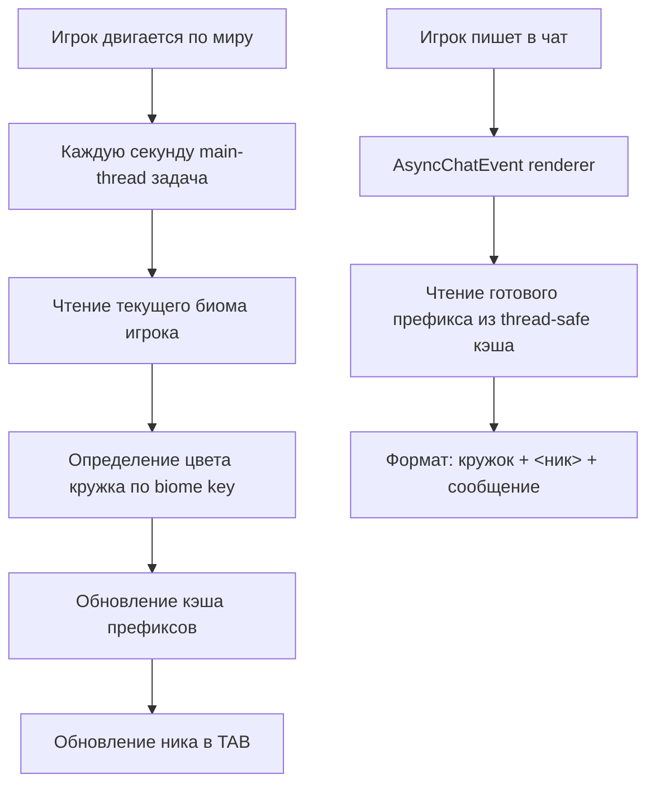

# 🌍 Biome Nickname Plugin (Paper 1.21.4)

Красивый и лёгкий плагин для Minecraft (Paper), который добавляет **цветной кружочек возле ника игрока**:
- в **чате**,
- в **TAB-листе**.

Цвет кружочка автоматически меняется в зависимости от биома, где находится игрок.

---

## ✨ Возможности

- 🎯 Автоматическое определение биома у каждого игрока.
- 💬 Отображение цветного кружка в чате перед ником.
- 📋 Отображение цветного кружка в TAB-листе.
- ⚡ Обновление в реальном времени (раз в секунду).
- 🔧 Простая настройка символа через `config.yml`.
- 🧩 Совместимость с **Paper 1.21.4**.
- 🔌 Совместим с внешними чат-плагинами (например, `chatgl-mc`): плагин сохраняет их формат/плейсхолдеры и добавляет кружок отдельным префиксом.

---

## 🧠 Логика цветов (по умолчанию)

Плагин определяет цвет по ключу биома:

- **Энд-биомы** (`*end*`) → `LIGHT_PURPLE` (розово-фиолетовый)
- **Незер** (`*nether*`, `crimson`, `warped`, `soul`, `basalt`) → `RED`
- **Вода** (`ocean`, `river`, `beach`) → `AQUA`
- **Снег/лёд** (`snow`, `ice`, `frozen`, `jagged`, `grove`) → `WHITE`
- **Пустыня/бедлендс/саванна** → `GOLD`
- **Болота** (`swamp`, `mangrove`) → `DARK_GREEN`
- **Леса/джунгли/равнины** → `GREEN`
- **Горы/пики/ветреные зоны** → `GRAY`
- **Грибной остров** (`mushroom`) → `LIGHT_PURPLE`
- Всё остальное → `YELLOW`

---

## 🤝 Совместимость с chatgl-mc и плейсхолдерами

## 🔤 PlaceholderAPI поддержка

Если на сервере установлен **PlaceholderAPI**, доступны плейсхолдеры:

- `%biomenick_prefix%` → цветной кружок + пробел (например `§a● `)
- `%biomenick_circle%` → только цветной кружок без пробела (например `§a●`)
- `%biomenick_symbol%` → символ из конфига без цвета

Пример для chatgl-mc (или любого форматтера):

```text
%biomenick_prefix%{prefix}<%player_name%> %message%
```

Так вы сами контролируете, **где именно** показывать кружок в формате чата.

Если используете плейсхолдер в формате чата, поставьте в `config.yml`:
`prepend-in-chat: false` — чтобы не было дубля.

---

Плагин **не перезаписывает** формат чата вручную. Вместо этого он:
1. Берёт текущий renderer, уже подготовленный другими чат-плагинами.
2. Использует результат этого renderer (со всеми плейсхолдерами/префиксами/форматом).
3. Добавляет биомный кружок **снаружи** как отдельный префикс.

Итог: формат `chatgl-mc` сохраняется, а кружок отображается стабильно.

---

## 🧭 Схема работы плагина



### Что это даёт
- Кружок в чате теперь выводится **перед** угловой скобкой (`● <nick> msg`), а не внутри неё.
- Потокобезопасность: чат-рендер не вычисляет биом и не обращается к миру асинхронно.
- Минимальная нагрузка: расчёт цвета выполняется только в синхронной задаче обновления.

---

## 📦 Установка

1. Скачайте `biome-nickname-plugin-1.0.0.jar` из релиза или соберите самостоятельно.
2. Поместите `.jar` в папку `plugins/` вашего Paper-сервера.
3. Перезапустите сервер.
4. (Опционально) Отредактируйте `plugins/BiomeNicknamePlugin/config.yml`.

---

## ⚙️ Конфиг

Файл: `plugins/BiomeNicknamePlugin/config.yml`

```yml
# Symbol displayed before player nickname in chat and tab.
# You can set almost any unicode symbol.
symbol: "●"

# If true, the plugin prepends a biome icon in chat automatically.
# Set to false if you want to place %biomenick_prefix% manually in your chat plugin format.
prepend-in-chat: true
```

Примеры символов:
- `●`
- `⬤`
- `◆`
- `✦`

---

## 🛠️ Сборка из исходников

Требования:
- **Java 21**
- **Maven 3.9+**

Команда сборки:

```bash
mvn clean package
```

Готовый файл появится в:

```text
target/biome-nickname-plugin-1.0.0.jar
```

---

## 🚀 Релиз 1.0.0

Что входит в релиз:

- Первая стабильная версия плагина.
- Поддержка Paper 1.21.4.
- Кружок по биому в чате и TAB.
- Настройка символа через конфиг.

---

## ✅ Проверка перед релизом

Рекомендуемый чек-лист:

1. Запустить сборку `mvn clean package`.
2. Проверить загрузку плагина на Paper 1.21.4.
3. Пройти по разным биомам и убедиться, что цвет меняется.
4. Проверить чат и TAB одновременно.

---

## 📄 Лицензия

Используйте свободно в своих проектах и на серверах. При желании можно добавить свою лицензию (например, MIT).


## 🧯 Если Paper пишет "does not contain a paper-plugin.yml or plugin.yml"

Это означает, что в `.jar` попал неправильный набор файлов (обычно не та сборка/не тот артефакт).

Проверьте:
- вы копируете именно **собранный jar плагина**, а не source-archive;
- внутри `.jar` есть `plugin.yml` и `paper-plugin.yml` в корне архива;
- на сервере удалена старая сломанная копия из `plugins/` и `plugins/.paper-remapped/`.

Полезно перед запуском сервера:
```bash
rm -rf plugins/.paper-remapped
```

---

